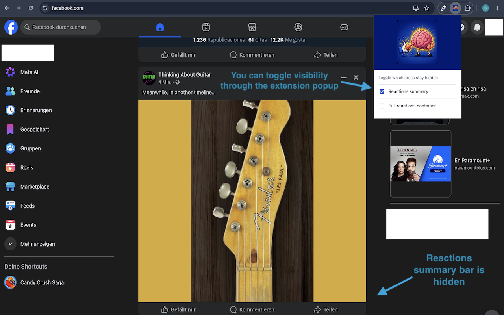

<!-- More about "user-content-toc"? See https://stackoverflow.com/questions/78111887/how-to-remove-unwanted-horizontals-line-in-markdown -->

  <ul align="center" style="list-style: none">
    

      <h1><i>FB Sanity</i></h1>
    

  </ul>

## <i>What's this?</i>
FB Sanity is a browser extension (Chrome support only for now) whose goal is to toggle the visibility of the reaction summary bar (you know, where the  👍❤️😂😡 counters are)  and / or the full reactions container (including the bar where the like button is).

Website: https://fb-sanity.web.app/

    

## <i>The "why"</i>
Looking at the Facebook reactions (you know, the  👍❤️😂😡...) counters  can trigger a nerve on some people. They are evidence of cancellation and sometimes reflect inmature or hateful attitudes from people that react to a post.

Even if you try, it's hard to ignore them and they may affect you in ways that neither psychologists and sociologists can truly tell.

The fact that there is free speech does not matter that we automatically can easily tolerate that speech, even if we try (or even want to do so). The online world can be a sick place nowadays.

But still, we want to see some memes, sports, news, inspiring stuff and keep contact with our friends on Facebook.

Thus, the goal of this extension is to toggle that toxicity (or sometimes utility) as needed.

You'll move through the feed like it was a walk on a calm place.

## <i>How does it work?</i>
Just basic DOM manipulation with JS. It uses browser storage to persist the configurations.
